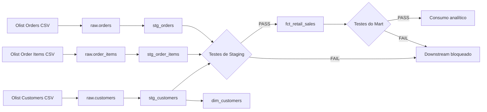

# Retail Sales Analytics Engineering & Data Quality — Olist

Pipeline analítico construído com **dbt + DuckDB** para transformar dados públicos da Olist em um Mart de vendas com **Model Contract, testes automatizados, reconciliação entre camadas e bloqueio de propagação de dados inválidos**.

O principal Data Product disponibilizado pelo projeto é:

```text
fct_retail_sales
```

Seu grão é **Pedido + Produto**: quando o mesmo produto aparece mais de uma vez em um pedido, as ocorrências são consolidadas em uma única linha.

---

## Autoria

<table>
  <tr>
    <td align="center">
      
      <br/>
      <b>Thatiane Botelho</b>
      <br/>
      <a href="https://github.com/ThatianeBotelho">GitHub</a>
    </td>
    <td align="center">
      
      <br/>
      <b>Tatiane Silva</b>
      <br/>
      <a href="https://github.com/tatiane-ss">GitHub</a>
    </td>
    <td align="center">
      
      <br/>
      <b>Viviane Corrêa</b>
      <br/>
      <a href="https://github.com/vivianecorrea">GitHub</a>
    </td>
  </tr>
</table>

---

## Visão geral

A solução organiza o processamento em três níveis:

- **Raw:** dados originais da Olist carregados no DuckDB;
- **Staging:** padronização, tipagem e validações de qualidade;
- **Marts:** modelos preparados para consumo analítico.

O fluxo principal é:

```text
Olist CSV
   ↓
Raw
   ↓
Staging
   ↓
Testes de qualidade
   ↓
Mart
   ↓
fct_retail_sales
```

O Mart `fct_retail_sales` contém:

| Campo | Definição |
|---|---|
| `sales_line_id` | chave técnica de Pedido + Produto |
| `sale_date` | data da compra |
| `order_id` | identificador do pedido |
| `customer_id` | identificador único do cliente |
| `product_id` | identificador do produto |
| `quantity` | quantidade do produto no pedido |
| `sales_amount` | soma do preço dos itens, sem frete |
| `order_status` | status operacional do pedido |

`quantity` é calculada pela contagem das ocorrências do produto em cada pedido e `sales_amount` pela soma de `price` dessas ocorrências.

---

## Arquitetura



O modelo `fct_retail_sales` possui **Model Contract** com:

```yaml
contract:
  enforced: true
```

O contrato protege a interface do Data Product contra alterações estruturais incompatíveis.

---

## Controles de qualidade

A solução combina diferentes mecanismos de validação ao longo da esteira:

| Controle | Implementação |
|---|---|
| **Model Contract** | contrato ativo em `fct_retail_sales` |
| **dbt-expectations** | validações de faixas e volumetria |
| **Reconciliação entre camadas** | comparação entre Staging e Mart |
| **DAG Circuit Breaker** | bloqueio do downstream após falha de qualidade |

### Model Contract

O schema de `fct_retail_sales` está declarado em:

```text
models/marts/schema_mart.yml
```

O contrato está configurado como:

```yaml
config:
  contract:
    enforced: true
```

As colunas e seus tipos são declarados explicitamente. Uma alteração estrutural incompatível impede a materialização do Mart.

O comportamento foi validado adicionando temporariamente uma coluna não declarada ao modelo. O dbt rejeitou a alteração com:

```text
coluna_nao_contratada | VARCHAR | missing in contract
```

---

### Testes com dbt-expectations

O projeto utiliza:

```text
metaplane/dbt_expectations
```

além dos testes nativos do dbt.

As principais validações são:

| Validação | Faixa esperada |
|---|---|
| `price` | 0.01 a 100000.00 |
| `freight_value` | 0 a 100000.00 |
| `quantity` | 1 a 100 |
| `sales_amount` | 0.01 a 100000.00 |
| quantidade de registros do Mart | 50000 a 150000 |

Também são utilizados testes nativos:

```text
not_null
unique
accepted_values
relationships
```

---

### Reconciliação entre Staging e Mart

O teste singular:

```text
tests/assert_sales_amount_reconciliation.sql
```

recalcula `quantity` e `sales_amount` a partir de `stg_order_items`, no mesmo grão utilizado pelo Mart:

```text
Pedido + Produto
```

Os resultados são comparados aos valores publicados em:

```text
fct_retail_sales
```

Em um teste singular do dbt:

```text
0 linhas retornadas = PASS
1 ou mais linhas     = FAIL
```

Assim, um resultado sem divergências confirma a reconciliação das métricas entre as camadas.

---

### DAG Circuit Breaker

O projeto inclui um experimento controlado de injeção de dados inválidos:

```text
order_status = 'CORRUPTED_STATUS'
price = -999.50
```

Os testes da camada de Staging identificam as violações antes da propagação dos dados.

Como `fct_retail_sales` depende desses modelos, uma falha upstream impede sua reconstrução.

Durante o experimento, o resultado registrado foi:

```text
PASS=20 WARN=0 ERROR=2 SKIP=16 TOTAL=38
```

O modelo `fct_retail_sales` foi marcado como:

```text
SKIP
```

Após a restauração dos dados, a esteira retornou ao estado saudável:

```text
PASS=38 WARN=0 ERROR=0 SKIP=0 TOTAL=38
```

---

## Resultados da execução

A solução foi executada de ponta a ponta no **GitHub Codespaces**.

| Cenário | Resultado | Evidência |
|---|---|---|
| Build inicial | 38 execuções aprovadas, sem erros | [`03_build_saudavel.txt`](evidencias/03_build_saudavel.txt) |
| Consulta do Mart | resultado analítico gerado com sucesso | [`04_query_results.txt`](evidencias/04_query_results.txt) |
| Dados corrompidos | 2 erros em Staging e 16 nós ignorados | [`06_circuit_breaker.txt`](evidencias/06_circuit_breaker.txt) |
| Restauração | esteira novamente saudável | [`08_build_restaurado.txt`](evidencias/08_build_restaurado.txt) |
| Violação do Model Contract | coluna extra rejeitada | [`09_model_contract_fail.txt`](evidencias/09_model_contract_fail.txt) |
| Build final | 38 execuções aprovadas, sem erros | [`10_build_pos_contract.txt`](evidencias/10_build_pos_contract.txt) |

---

## Estrutura do projeto

A estrutura do repositório é organizada da seguinte forma:

```text
.
├── docs/
│   └── runbook_execucao.md
│
├── evidencias/
│
├── models/
│   ├── marts/
│   │   ├── dim_customers.sql
│   │   ├── fct_retail_sales.sql
│   │   └── schema_mart.yml
│   │
│   └── staging/
│       ├── schema_stg.yml
│       ├── sources.yml
│       ├── stg_customers.sql
│       ├── stg_order_items.sql
│       └── stg_orders.sql
│
├── scripts/
│   ├── 01_prepare_olist.py
│   ├── 02_query_results.py
│   ├── 03_inject_corruption.py
│   └── 04_restore_data.py
│
├── tests/
│   └── assert_sales_amount_reconciliation.sql
│
├── .gitignore
├── dbt_project.yml
├── package-lock.yml
├── packages.yml
├── profiles.yml
├── README.md
└── requirements.txt
```

### `models/`

Contém os modelos executados pelo dbt.

#### `models/staging/`

Camada de preparação dos dados antes do consumo analítico.

**`sources.yml`**

Declara para o dbt as tabelas de origem existentes no schema `raw` do DuckDB.

**`schema_stg.yml`**

Define a documentação e os testes de qualidade da Staging, incluindo `not_null`, `unique`, `accepted_values` e validações com `dbt-expectations`.

**Modelos SQL**

```text
stg_customers.sql
stg_order_items.sql
stg_orders.sql
```

São responsáveis por ler as fontes Raw e padronizar os dados utilizados nas transformações seguintes.

---

#### `models/marts/`

Contém os modelos preparados para consumo analítico.

**`dim_customers.sql`**

Cria a dimensão de clientes utilizada pelo Data Product e pelas validações de relacionamento.

**`fct_retail_sales.sql`**

Cria o principal modelo analítico do projeto, consolidando as vendas no grão:

```text
Pedido + Produto
```

**`schema_mart.yml`**

Define os testes do Mart, os tipos das colunas e o Model Contract de `fct_retail_sales`.

---

### `scripts/`

Contém os scripts Python utilizados na preparação, consulta e manipulação dos dados.

**`01_prepare_olist.py`**

Cria o banco DuckDB, carrega os arquivos CSV no schema `raw` e gera as tabelas de backup utilizadas na restauração.

**`02_query_results.py`**

Consulta o Mart e apresenta métricas e amostras do resultado final.

**`03_inject_corruption.py`**

Injeta valores inválidos de forma controlada para validar o comportamento do DAG Circuit Breaker.

**`04_restore_data.py`**

Restaura as tabelas Raw a partir das cópias de backup.

---

### `tests/`

Contém os testes singulares escritos em SQL.

**`assert_sales_amount_reconciliation.sql`**

Recalcula `quantity` e `sales_amount` a partir da Staging e compara os resultados com `fct_retail_sales`.

---

### `evidencias/`

Armazena os logs das principais etapas da execução, incluindo:

- preparação do DuckDB;
- validação da conexão;
- build saudável;
- consulta do Mart;
- injeção de dados inválidos;
- Circuit Breaker;
- restauração dos dados;
- validação do Model Contract;
- build final.

As evidências permitem consultar os resultados registrados sem repetir os experimentos.

---

### `docs/`

Contém a documentação operacional do projeto.

**`runbook_execucao.md`**

Apresenta o passo a passo para preparar o ambiente, executar a esteira e reproduzir as validações e experimentos.

---

### Arquivos da raiz

**`.gitignore`**

Define arquivos e diretórios que não devem ser versionados, como ambiente virtual, banco DuckDB local e arquivos de dados baixados durante a execução.

**`dbt_project.yml`**

Arquivo principal de configuração do projeto dbt. Define o diretório dos modelos e testes, além das materializações utilizadas nas camadas.

**`profiles.yml`**

Configura a conexão do dbt com:

```text
data/analytics.duckdb
```

**`packages.yml`**

Declara os pacotes adicionais utilizados pelo dbt, incluindo:

```text
metaplane/dbt_expectations
```

**`package-lock.yml`**

Registra as versões efetivamente resolvidas dos pacotes dbt.

**`requirements.txt`**

Lista as dependências Python necessárias para executar o projeto:

```text
dbt-core
dbt-duckdb
duckdb
kaggle
pandas
```

**`README.md`**

Apresenta a visão geral, arquitetura, controles de qualidade, resultados e instruções de execução do projeto.

---

## Dados de origem

Fonte:

**Brazilian E-Commerce Public Dataset by Olist**

Arquivos utilizados:

```text
data/raw/olist_orders_dataset.csv
data/raw/olist_order_items_dataset.csv
data/raw/olist_customers_dataset.csv
```

A pasta `data/` não é versionada no GitHub.

Com a Kaggle CLI autenticada, os dados podem ser baixados com:

```bash
mkdir -p data/raw

kaggle datasets download olistbr/brazilian-ecommerce \
  -p data/raw \
  --unzip
```

---

## Execução rápida

A execução foi preparada para o **GitHub Codespaces**.

No GitHub:

```text
Code
→ Codespaces
→ Create codespace on main
```

No terminal do Codespaces, a partir da raiz do repositório:

```bash
python -m venv .venv
source .venv/bin/activate

python -m pip install --upgrade pip
pip install -r requirements.txt

dbt deps --profiles-dir .

mkdir -p data/raw
kaggle datasets download olistbr/brazilian-ecommerce -p data/raw --unzip

python scripts/01_prepare_olist.py

dbt debug --profiles-dir .
dbt build --profiles-dir .

python scripts/02_query_results.py
```

O procedimento completo para executar o pipeline e reproduzir os testes de qualidade está disponível em:

[`docs/runbook_execucao.md`](docs/runbook_execucao.md)

---

## Decisões de implementação

**DuckDB** foi utilizado como engine analítica local para manter o projeto simples e reproduzível.

Os modelos de **Staging** são materializados como `view` e os modelos de **Mart** como `table`.

O campo:

```text
sales_amount
```

representa a soma dos preços dos produtos e **não inclui o valor do frete**.

O status do pedido é preservado no Data Product para permitir que diferentes consumidores apliquem os filtros adequados aos seus casos de uso.

As tabelas:

```text
raw.orders_clean
raw.order_items_clean
raw.customers_clean
```

são utilizadas como cópias de referência para restaurar os dados após o experimento de Circuit Breaker.

O arquivo:

```text
package-lock.yml
```

registra as versões resolvidas dos pacotes dbt, contribuindo para a reprodutibilidade do projeto.